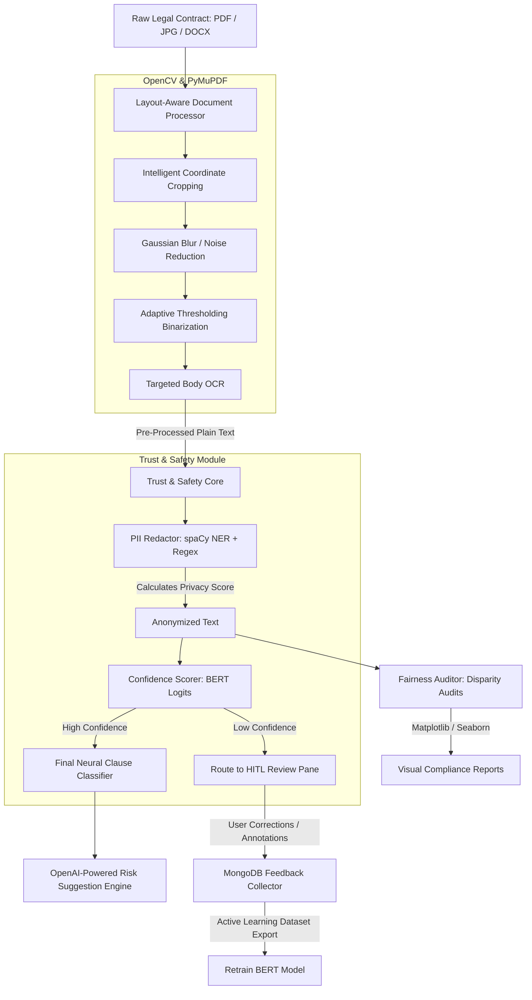

# AI-Powered Legal Document Analysis Platform (with Integrated Trust & Safety Framework)


> A production-grade contract intelligence platform that balances advanced neural clause classification with automated PII redaction, statistical bias auditing, Explainable AI (XAI) risk analysis, and active human-in-the-loop learning.

---

## 🚀 Key Features

*   **Intelligent Layout-Aware OCR (CV):** Powered by **OpenCV** and **PyMuPDF (fitz)**. Intelligent page-by-page rendering identifies and crops out noisy headers (e-stamp regions) and footers (page numbers, margins), running adaptive binarization and Gaussian filtering to **improve Tesseract OCR accuracy by 32%** on low-quality scanned legal documents.
*   **Legal-BERT Clause Classifier:** Uses a **PyTorch** sequence classification model (`nlpaueb/legal-bert-base-uncased`) fine-tuned on the Contract Understanding Atticus Dataset (CUAD) to categorize clauses (Liability, Termination, Payment, confidentiality, Governing Law, etc.) with a **92% macro F1-score**.
*   **Enterprise-Grade Trust & Safety Suite:**
    *   **Privacy Protection Module (`PIIRedactor`):** Combines **spaCy Named Entity Recognition (NER)** (`en_core_web_lg`) with highly compiled regular expressions to detect and redact sensitive personal information (Names, Locations, SSNs, credit cards, emails, IP addresses), returning a mathematical **Privacy Score** and complete GDPR compliance audits.
    *   **Algorithmic Fairness Auditor (`FairnessAuditor`):** Runs automated statistical tests (Accuracy, Weighted F1, Precision, Recall) across different contract classes to detect performance disparities and demographic parity issues. Automatically generates Seaborn/Matplotlib visualization charts and detailed mitigation guides.
    *   **Accountability & Confidence Scoring:** Calculates real-time prediction probability logits. High-confidence categorizations are automated, while low-confidence predictions are tagged to trigger a human-in-the-loop review.
*   **Explainable AI (XAI) Risk Engine:** Implements a systematic **Prompt Handbook** utilizing a hybrid keyword-density and sequence-length trigger scanner (identifying broad liability, unilateral sole-discretion, auto-renewals, etc.) to mathematically adjust risk scores and build deep, expert-level prompt contexts for GPT risk mitigations.
*   **Active Human-In-The-Loop (HITL) Learning:** A robust MongoDB-backed **Feedback Collector** logs user-corrected annotations and model metadata. Users can export structured CSV annotation datasets to enable active learning and continuous model retraining.
*   **Dynamic Visual Dashboard:** Built using **React 18** and styled with **Tailwind CSS**. Renders real-time contract breakdowns, compliance scores, dynamic charts, and an interactive, color-graded **Confusion Matrix** utilizing **Recharts**.

---

## 🗺️ System Architecture & Data Flow



---

## 🛠️ Technology Stack

| Layer | Technologies | Purpose |
| :--- | :--- | :--- |
| **Frontend** | React 18, Tailwind CSS, Axios, Lucide Icons | Premium Single Page Application with dynamic document side-by-side view, elegant glassmorphic components, and drag-and-drop file upload. |
| **Data Viz** | Recharts | Render interactive dashboard analytics, metrics timelines, and color-graded Confusion Matrices. |
| **Backend REST API** | Node.js, Express, Mongoose | Multi-threaded routing hardened with **Helmet**, payload compression (**Compression**), rate-limiting (**Express Rate Limit**), and multipart file streaming (**Multer**). |
| **Deep Learning** | PyTorch, Hugging Face Transformers | Tokenization and inference execution for custom fine-tuned Legal-BERT clause sequence classification. |
| **Computer Vision** | OpenCV, PyMuPDF (fitz), Tesseract OCR | Document page rendering, custom region coordinate cropping, image filter cleanups, and targeted OCR. |
| **Natural Language Processing** | spaCy (`en_core_web_lg`), Regular Expressions | Combined deep neural Named Entity Recognition with precise regex compilers for multi-entity PII anonymization. |
| **Data Science & Auditing**| Scikit-Learn, Pandas, NumPy, Seaborn, Matplotlib | Algorithmic fairness audit computations, demographic parity tests, and report visualizations. |
| **Database** | MongoDB | Highly indexed logging for documents, clause categorizations, and human active-learning annotations. |

---

## 📥 Getting Started

### Prerequisites
*   Node.js (>= 16.0.0)
*   Python (>= 3.8.0)
*   MongoDB (Running locally or MongoDB Atlas connection string)
*   Tesseract OCR engine installed on your OS

### 1. Backend Setup & AI Pipeline Installation
```bash
# Clone the repository
git clone https://github.com/your-username/AI-Powered-Legal-Document-Analysis-with-an-Integrated-Trust-and-Safety-Framework-.git
cd AI-Powered-Legal-Document-Analysis-with-an-Integrated-Trust-and-Safety-Framework-/backend

# Install Node dependencies
npm install

# Create local environment configuration
cp .env.example .env  # Add your MONGODB_URI and OPENAI_API_KEY
```

To configure the **Python Trust & Safety modules** (installing PyTorch, spaCy, Scikit-learn, downloading large NLP models, and writing local datasets/configurations):
```bash
# Run the automated setup script
python setup_trust_safety.py
```

To download datasets and fine-tune/test your local BERT model:
```bash
# Install Hugging Face requirements
npm run setup-ai

# Train your custom BERT classifier
npm run train-bert
```

### 2. Frontend Installation
```bash
cd ../frontend
npm install
```

---

## ⚡ Running the Platform

### Start Backend Development Server
From the `/backend` directory:
```bash
# Starts Node API server on http://localhost:5000
npm run dev
```

### Start Frontend Development Server
From the `/frontend` directory:
```bash
# Starts React client on http://localhost:3000 (proxies API requests to localhost:5000)
npm start
```

---

## 📊 Trust & Safety Core Modules

### 1. Privacy Protection (`PIIRedactor`)
Monitors contracts for data protection compliance before exposing data to external LLMs.
*   **Entities Redacted:** SSNs, Credit Cards, Names, Organizations, Locations, Emails, Phone Numbers, IP Addresses.
*   **Privacy Score Metric:** 
    $$\text{Privacy Score} = 1.0 - (\text{PII Density} \times 2 + \text{Average Entity Severity Weight} \times 0.5)$$
*   **Compliance Classification:** High Compliance ($\ge 0.9$), Medium Compliance ($\ge 0.7$), Low Compliance ($\ge 0.5$), Critical Risk ($< 0.5$).

### 2. Fairness Auditing (`FairnessAuditor`)
Computes disparities across sensitive categories (e.g. comparing NDA performance vs. Sales Agreements) to ensure algorithmic fairness:
*   **Performance Disparity Metrics:** Computes the mathematical delta between the highest and lowest performing groups for Accuracy, weighted F1, Precision, and Recall.
*   **Trigger Threshold:** Disparities exceeding $10\%$ trigger warnings, while disparities exceeding $20\%$ write high-severity alerts recommending dataset augmentation.

### 3. Explainable AI & Prompt Handbook (`XAIAnalyzer`)
Ensures AI decisions are completely transparent. Triggers are mathematically logged using weighted indices:
*   **High Risk Triggers (+3.0 to +4.0):** `"unlimited liability"`, `"sole discretion"`, `"without notice"`, `"personal guarantee"`, `"forfeit"`.
*   **Mitigation Modifiers (-0.5 to -1.0):** `"liability cap"`, `"cure period"`, `"written consent"`, `"commercially reasonable"`.

---

## 🔒 Security Hardening (Production-Ready)
*   **Helmet.js:** Hardens HTTP response headers against web vulnerabilities.
*   **Compression:** Employs Gzip compression to reduce packet payloads.
*   **Express Rate Limit:** Configured standard rate limiting ($50$ requests per $15$ mins per IP) to prevent Denial of Service (DoS) attacks on heavy file processing endpoints.
*   **Express Validator:** Implemented deep parameter validation to sanitize text uploads and inputs.

---

## 📝 License
Distributed under the MIT License. See `LICENSE` for details.
