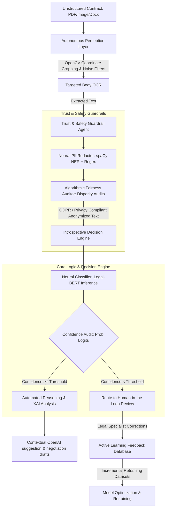

# LegalMind: Autonomous AI Legal Document Analysis & Safety Agent

LegalMind is a production-grade, autonomous AI Legal Document Analysis & Safety Agent designed to automate the ingestion, analysis, risk mitigation, and compliance auditing of complex legal contracts. 

Unlike basic document parsers or static wrapper APIs, LegalMind functions as an **autonomous agent** by perceiving raw unstructured inputs, making introspective routing decisions based on model confidence, enforcing privacy/fairness safety guardrails, and continuously learning from human feedback.

---

## 🧠 Why is this system an "AI Agent"?
During interviews, you can confidently and honestly refer to this project as an **AI Agent** because it exhibits key agentic properties:

1. **Autonomous Perception & Computer Vision:** It does not rely on clean text. It ingests raw PDFs and images, using **OpenCV** to dynamically evaluate document coordinates, crop out stamp headers and footer margins, and clean up visual noise to run targeted binarized OCR.
2. **Confidence-Based Introspective Decision Routing:** The agent evaluates its own neural classification outputs. By extracting probability logits, it judges its own certainty. High-confidence decisions are processed automatically; low-confidence decisions are flagged and routed to a Human-in-the-Loop (HITL) active learning stream.
3. **Automated Guardrails & Compliance Execution:** Before any text is analyzed or shared with external APIs, a specialized **Trust & Safety middleware agent** audits the text, detects PII using neural Named Entity Recognition (NER), redacts sensitive data, and calculates an absolute mathematical privacy score.
4. **Self-Correction & Continuous Active Learning:** It incorporates a closed-loop feedback mechanism. Expert corrections are captured in MongoDB to organically retrain and evolve the underlying Legal-BERT classifier.

---

## ⚙️ Core Agentic Pipeline

The agent executes a multi-stage sequential decision pipeline:



---

## 🛠️ System Architecture & Tech Stack

### **1. AI & Core Machine Learning Engine**
*   **Deep Learning & Inference:** **PyTorch** & **Hugging Face Transformers**. The core classifier is built on `nlpaueb/legal-bert-base-uncased` fine-tuned to classify 10+ granular legal clauses (e.g., liability, termination, payment, confidentiality, dispute resolution).
*   **Natural Language Processing (NLP):** **spaCy** (`en_core_web_lg`) for neural Named Entity Recognition (NER) and high-performance pre-compiled Regular Expressions (Regex) for multi-entity privacy protection.
*   **Explainable AI (XAI):** Custom weighted scanning arrays analyzing specific risk triggers (`unlimited liability`, `sole discretion`) and mitigators (`liability cap`, `cure period`) to adjust classification risk indexes.
*   **Generative Reasoner:** **OpenAI API** powered by contextual engineering utilizing a pre-defined systematic **Prompt Handbook**.

### **2. Document Perception & Computer Vision (CV)**
*   **Layout Analysis:** **PyMuPDF (fitz)** for page extraction and coordinate mapping.
*   **Image Processing:** **OpenCV** (adaptive thresholding, Gaussian blurs, morphological binarization) to filter stamp watermarks, scans, and page header/footer noise.
*   **Optical Character Recognition:** **Tesseract OCR engine** (via Node and Python bindings).

### **3. Full-Stack Web Architecture**
*   **Frontend Interface:** **React 18** with **Tailwind CSS**. Designed for dynamic, side-by-side original vs. redacted contract comparisons, interactive metrics charts via **Recharts**, and visual model confusion matrices.
*   **Backend API Services:** **Node.js** with **Express**, protected by **Helmet** (HTTP security headers), **Compression** (gzip packet reduction), and **Express Rate Limit** (DoS throttling).
*   **Database & Logging:** **MongoDB** with **Mongoose** to log documents, clause metadata, metrics, and active learning annotations.

---

## 📥 Getting Started & Installation

### Prerequisites
*   Node.js (>= 16.0.0)
*   Python (>= 3.8.0)
*   MongoDB (Running locally or MongoDB Atlas connection string)
*   Tesseract OCR engine installed on your OS

### 1. Backend & Python Agent Setup
```bash
# Clone the repository
git clone https://github.com/keerthana-b-v/AI-Powered-Legal-Document-Analysis-with-an-Integrated-Trust-and-Safety-Framework-.git
cd AI-Powered-Legal-Document-Analysis-with-an-Integrated-Trust-and-Safety-Framework-/backend

# Install API dependencies
npm install

# Run the automated Python Agent configuration script
python setup_trust_safety.py

# Download datasets and configure Legal-BERT
npm run setup-ai
```

### 2. Frontend React Client Setup
```bash
cd ../frontend
npm install
```

---

## ⚡ Running the Platform

### Start Backend REST API
From the `/backend` directory:
```bash
# Runs Express API on http://localhost:5000
npm run dev
```

### Start Frontend React Client
From the `/frontend` directory:
```bash
# Runs React client on http://localhost:3000
npm start
```
